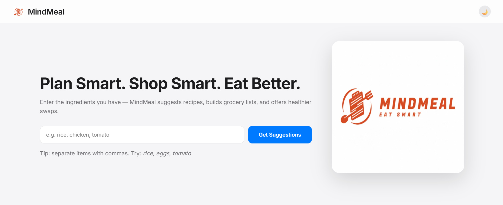

# 🍽️ MindMeal – AI-Powered Meal Planner

MindMeal is an intelligent meal-planning web application that suggests recipes based on the ingredients you already have.  
It generates realistic food images using an AI image API, maintains a smart pantry, provides healthy alternatives, and lets you download grocery lists — all inside a clean, iOS-inspired UI.

---
 
## ▶️ Project Video - Click To Open

---

## 🌐 Live Website

🚀 The project is live and can be accessed here:

👉 **Live Demo:** [Visit the Website](https://sujalpatil21.github.io/Mind-Meal/)

---

## ⭐ Features
 
### 🔍 Smart Recipe Suggestions
- Enter ingredients → get instant recipe matches  
- Veg / Non-Veg filtering  
- Highlights matched & missing ingredients  

### 🤖 AI Image Generation
- High-quality recipe images generated dynamically  
- Backend-only API usage for security  

### 🥫 Persistent Pantry System
- Automatically adds searched ingredients  
- Manual pantry management  
- Download pantry list  

### 💡 Healthy Alternatives
- Displays healthier ingredient swaps extracted from recipes  

### 🛒 Grocery List Generator
- Download complete grocery lists for any recipe  

### 🌓 Modern, Responsive UI
- iOS-inspired design  
- Smooth animations & transitions  
- Full dark mode support  

---

## 🏛️ System Architecture

### **Frontend (HTML + CSS + Vanilla JS)**
- Renders recipe cards  
- Handles modals (recipe, pantry, healthy swaps)  
- Dark mode + UI interactions  
- Fetch API calls to backend  

### **Backend (FastAPI + Python)**
- Processes ingredients  
- Matches recipes based on JSON  
- Pantry CRUD operations  
- AI image generation using prompt API  
- Returns structured JSON  
- Caches & serves generated images  

### **Storage Layer**
- `recipes.json` → predefined recipe data  
- `pantry.json` → persistent pantry  
- `generated/` → cached AI images  

---

## 📁 Files Used

### **Backend**
- `main.py`  
- `recipes.json`  
- `pantry.json`  

### **Frontend**

**Images/**
- `Logo.png`  
- `small_icon.png`  
- `small_icon_black.png`  

**Other Frontend Files**
- `index.html`  
- `script.js`  
- `style.css`  

---

## 🚀 How It Works (Short Overview)

1. User enters ingredients  
2. Backend matches recipes  
3. Frontend displays recipe cards  
4. Clicking a recipe triggers AI image generation  
5. Pantry auto-updates  
6. Healthy swaps collected  
7. Grocery list available for download  

---

## 📦 Installation & Setup

# Install backend dependencies
pip install fastapi uvicorn httpx pydantic

# Start backend server
uvicorn main:app --reload

# Open frontend in your browser
index.html

## 👨‍💻 Authors

- **Sujal Patil** – [GitHub](https://github.com/SujalPatil21)  
- **Shreya Awari** – [GitHub](https://github.com/shreyaawari28)  
- **Tejas Halvankar** – [GitHub](https://github.com/Tejas-H01)  
- **Nihal Mishra** – [GitHub](https://github.com/nihal27998)

